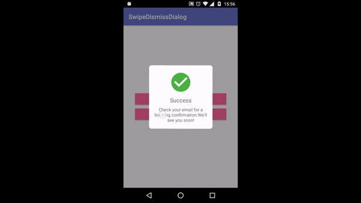
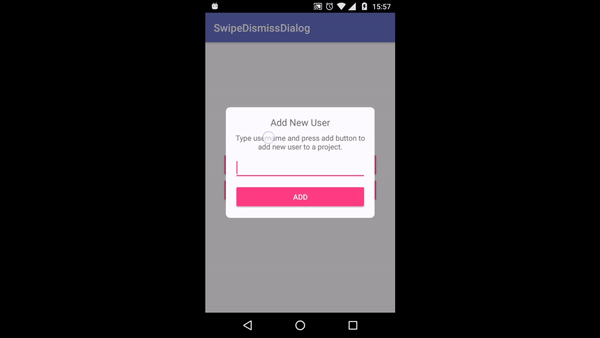
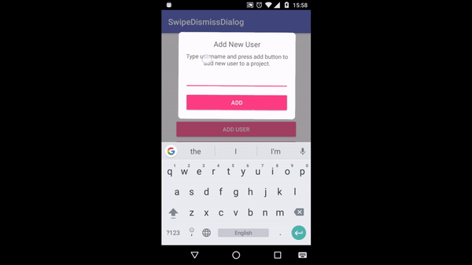

# Swipe-To-Dismiss-Dialog

## Demo
[]

[]

[]

## Download
TODO

## How to use

### Basic
* Set View
```java
View dialog = LayoutInflater.from(this).inflate(R.layout.dialog_add_user, null);
new SwipeDismissDialog.Builder(this)
                .setView(dialog)
                .build()
                .show();
```
* From layout resource
```java
new SwipeDismissDialog.Builder(this)
                .setLayoutResId(R.layout.dialog_success_booking)
                .build()
                .show();
```
### Callbacks
Listen for the canceled by tap outside/back pressed events:
```java
.setOnCancelListener(new OnCancelListener() {
    @Override
    public void onCancel(View view) {
        Toast.makeText(MainActivity.this, "Canceled", Toast.LENGTH_SHORT).show();
    }
})
```
Listen for the swipe dismiss event:
```java
.setOnSwipeDismissListener(new OnSwipeDismissListener() {
                    @Override
                    public void onSwipeDismiss(View view, SwipeDismissDirection direction) {
                        Toast.makeText(MainActivity.this, "Swipe dismissed to: " + direction, Toast.LENGTH_SHORT).show();
                    }
                })
```
### Customization
You can set some parameters:
```java
//Set fling gesture velocity. Range [0.0 - 1.0] 
//Default is 0.1f
.setFlingVelocity(0.07f)  
//Set horizontal oscillation. Range[0.0-35.0]
//Default is 35f
//This is the max rotation angle value
.setHorizontalOscillation(35f)
//Set overlay background color. Default is #80444444
.setOverlayColor(Color.parseColor("#80FF0000"))
```

##License
Copyright 2017 Lisun Andrii

Licensed under the Apache License, Version 2.0 (the "License");
you may not use this file except in compliance with the License.
You may obtain a copy of the License at

   http://www.apache.org/licenses/LICENSE-2.0

Unless required by applicable law or agreed to in writing, software
distributed under the License is distributed on an "AS IS" BASIS,
WITHOUT WARRANTIES OR CONDITIONS OF ANY KIND, either express or implied.
See the License for the specific language governing permissions and
limitations under the License.
